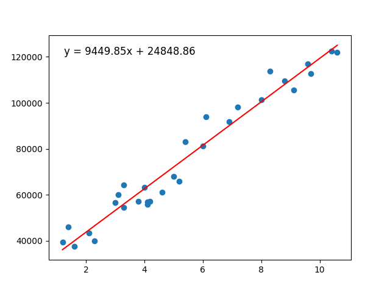
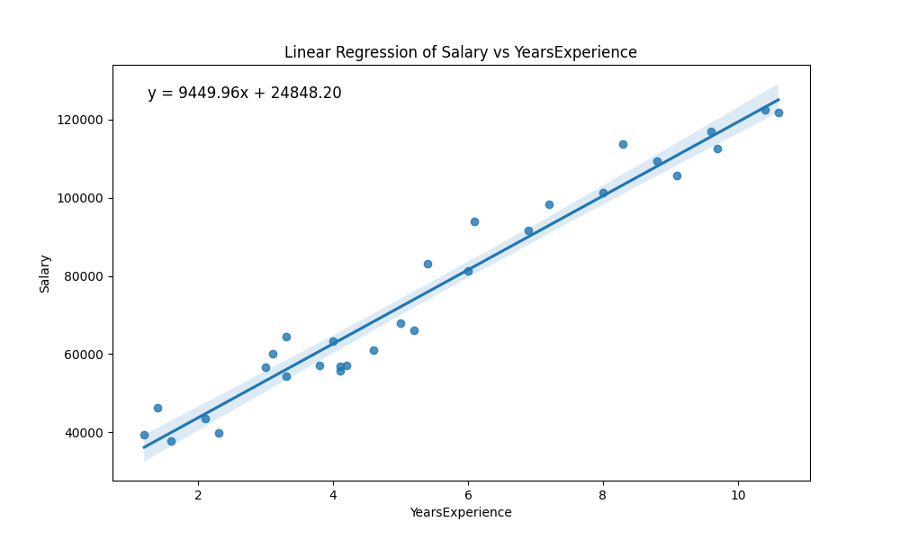

# Linear Regression from Scratch

This project implements a linear regression model from scratch using gradient descent, aiming to demonstrate the mechanics behind the algorithm without relying on other libraries. Dataset was found on Kaggle [(link here)](https://www.kaggle.com/datasets/abhishek14398/salary-dataset-simple-linear-regression/code)

## 1. Why I made this project
The goal was to deeply understand how linear regression works under the hood by implementing it manually, specifically focusing on the gradient descent optimization algorithm, rather than simply importing a pre-made function.

## 2. How we did it
We implemented linear regression by calculating the Mean Squared Error (MSE) and updating the slope ($m$) and intercept ($b$) using gradient descent.

The cost function is:
$$MSE = \frac{1}{n} \sum_{i=1}^n (y_i - (mx_i + b))^2$$

To minimize the error, we calculate the gradients with respect to $m$ and $b$:
$$\frac{\partial L}{\partial m} = -\frac{2}{n} \sum_{i=1}^n x_i(y_i - (mx_i + b))$$
$$\frac{\partial L}{\partial b} = -\frac{2}{n} \sum_{i=1}^n (y_i - (mx_i + b))$$

Parameters are updated as:
$$m = m - \alpha \cdot \frac{\partial L}{\partial m}$$
$$b = b - \alpha \cdot \frac{\partial L}{\partial b}$$
Where $\alpha$ is the learning rate.

### Results
Comparing our handmade model with the library-based approach:

| Implementation | Plot |
| :--- | :--- |
| **From Scratch** |  |
| **Seaborn** |  |

## 3. Issues encountered
The primary issue encountered was **data scaling**. Using a constant learning rate with raw input values (like "YearsExperience" vs "Salary") caused the gradient descent to diverge or fail to converge because the loss surface was too steep/unbalanced. We solved this by scaling the input and target variables before training and inverse-scaling the final parameters.

## 4. Possible improvements
*   **Adaptive Learning Rate:** Implement a decaying learning rate to help the model converge more efficiently.
*   **Early Stopping:** Instead of hardcoding the number of epochs, stop training when the change in loss falls below a small threshold ($\epsilon$).
*   **Data Validation:** Automate data cleaning and validation (e.g., ensuring exactly two columns, handling missing values) instead of relying on manual pre-processing scripts.
